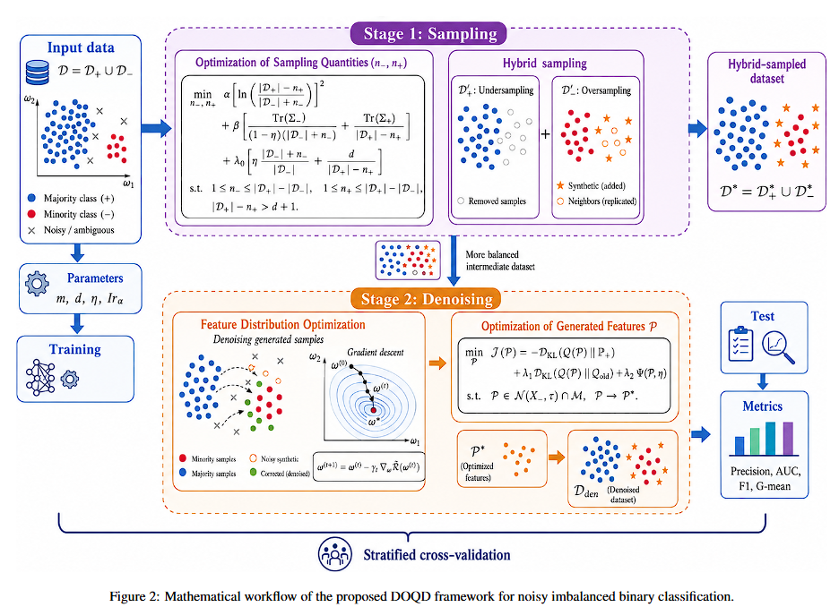
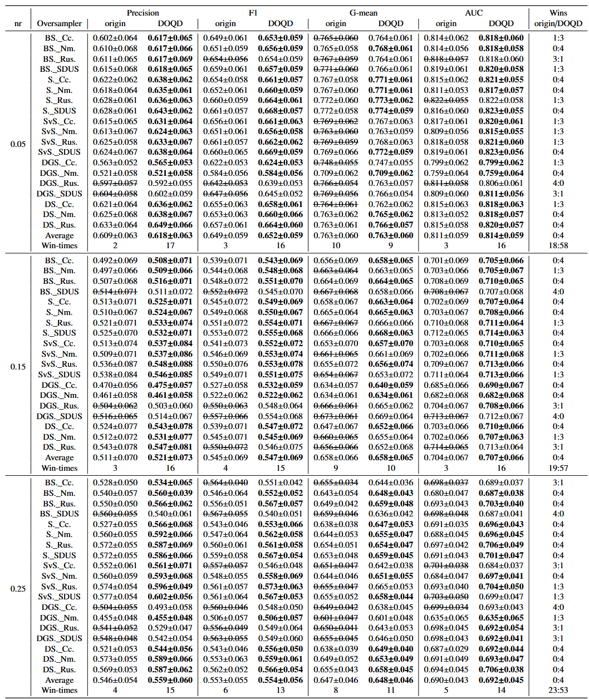
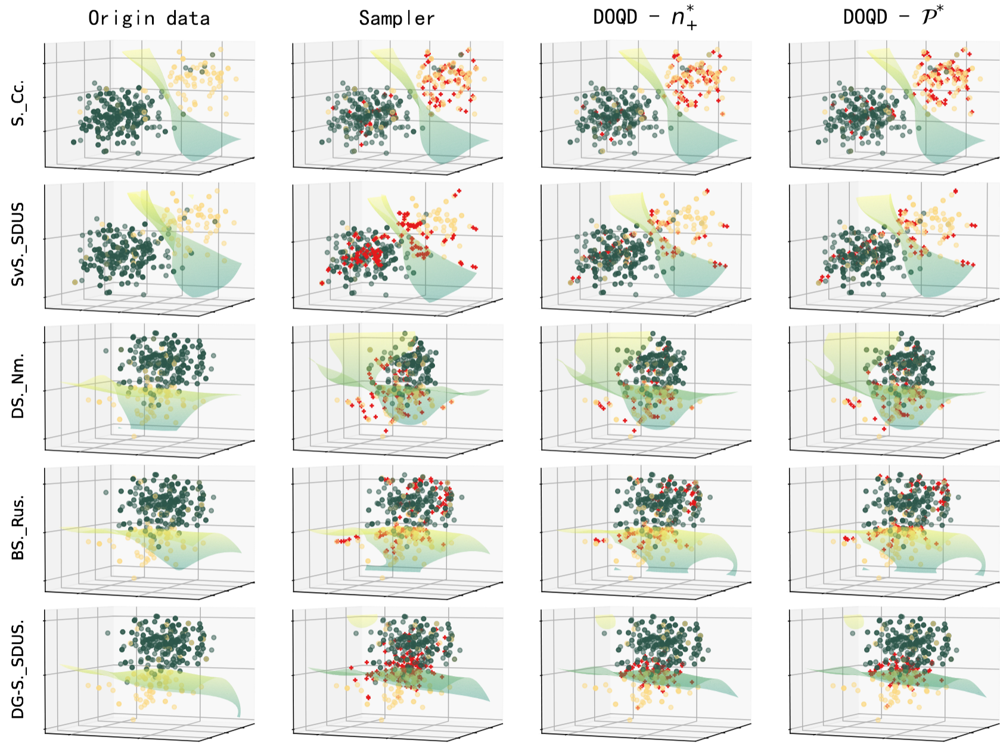
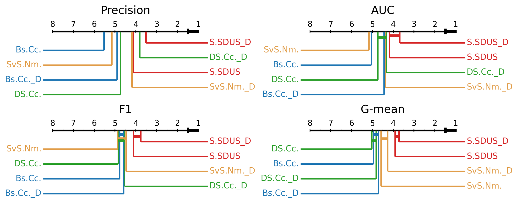

# DOQD: Decoupled Optimization of Sampling Quantities and Synthetic Feature Distributions for Noisy Imbalanced Learning

Official implementation of the paper:  **"DOQD: Decoupled Optimization of Sampling Quantities and Synthetic Feature Distributions for Noisy Imbalanced Learning"** .


## 📖 Overview

**DOQD** (Decoupled Optimization of Sampling Quantities and Synthetic Feature Distributions) is a robust hybrid-sampling framework designed to tackle the joint challenge of **class imbalance** and  **label noise** . Unlike traditional heuristic resampling, DOQD treats sampling as a formal optimization problem. The flowchart for **DOQD** is as follows.



## ✨ Key Features

- Supports multiple sampling strategies:

  - Oversampling: SMOTE, BorderlineSMOTE, SVMSMOTE, RandomOverSampler, SMOTEN, DG-SMOTE, DeepSMOTE
  - Undersampling: RandomUnderSampler, NearMiss, ClusterCentroids, SDUS
- Plug-and-play **DOQD framework** for distribution regularization
- Compatible with various classifiers:

  - AdaBoost, DTree, GBDT, KNN, LR, SVM, LightGBM, XGBoost
- Complete ablation experiment visualization, comparative trials, and Friedman statistical experiments

**Key Contributions:**

1) We propose a decoupled yet synergistic optimization framework (DOQD) for hybrid sampling. It consists of two  non-convex optimization models and is a general optimization mechanism that can be applied to various datasets and hybrid sampling. The characteristics of the datasets are quantified from multiple perspectives, and class imbalance and label noise are modeled as non-convex optimization problems. Through complementary optimization of sampling quantities and synthetic feature distributions, DOQD simultaneously addresses distributional rebalancing and noise-aware sample generation.
2) The first model is designed to derive theoretically optimal undersampling and oversampling rates. We design  adaptive prior bias, structural bias, and penalty terms. Multi-variate objective and constraint functions are proposed based on data complexity and class overlap, constructing a non-convex optimization model. We further establish the existence of a global optimum over the feasible domain.
3) The second model is designed to mitigate the impact of noisy samples and ensure synthetic samples closely approach the safety region of the minority class. By maximizing the KL divergence between the probability distributions of original features and sampled samples, it mathematically governs the synthetic feature space under strict anisotropic support constraints. This effectively alleviates noise and boundary-blurring issues introduced by random sampling.
4) Comparative experiments across 17 of public datasets and varying noise settings against multiple mainstream  sampling methods and frameworks demonstrate that the proposed optimization framework consistently improves the overall performance of diverse hybrid sampling strategies and exhibits competitive robustness across different classifiers.

## 📂 Project Structure
├── figs/

│      ├── classifier_para.png

│      ├── comparison.png

│      ├── dataset_info.png

│      ├── flowchart.png

│      ├── friedman.png

│      ├── CD.png

│      ├── sampler_para.png

│      └── visual.png

├── __api_experiments.cpython-38.pyc

├── _api_DOQD_BU.cpython-38.pyc

├── api.cpython-38.pyc

├── api_GB.cpython-38.pyc

├── api_OBHRF.cpython-38.pyc

├── DOQD_BH.cpython-38.pyc

├── DOQD_BO.cpython-38.pyc

├── draw_BH.cpython-38.pyc

├── draw_functions_OBHRF.cpython-38.pyc

├── friedman.cpython-38.pyc

├── NaN.cpython-38.pyc

├── requirements.txt

└── RSDS.cpython-38.pyc


## 🛠️ Installation

```bash
# Clone the repository
git clone https://github.com/xyzhou1534/DOQD.git
cd DOQD

# Install dependencies
pip install -r requirements.txt
```

## 🧪 Experimental Settings

The performance of **DOQD** for classification is evaluated and compare with currently available resamplers, as well as without any resampling. This section conducts simulation experiments under the following experimental settings. Moreover, all experiments are conducted on a Ubuntu 22.04 with an Intel e5-1650v4 CPU and $32$ GB of RAM.

**Datasets:** All actual datasets were obtained from the UCI (https://archive.ics.uci.edu/datasets) and KEEL (http://sci2s.ugr.es/keel/imbalanced.php) library. **DOQD** focuses on binary classification tasks, thus employing the OVR method to convert multiclass datasets into binary formats. Experiments encompassed multiple datasets with varying sample sizes from small to large, dimensions from low to high and imbalance rates from low to high. Detailed dataset information is asfollows.


The parameters of the sampler and classifier used in the experiment are as follows.


Information of sampler parameters.


Information of Classifier parameters.

## 📊 Experimental Results

- The ablation experiment for **DOQD** is visualized as follows.

  
- The comparative trial of DOQD is as follows: Average results based on 17 datasets, 8 classifier, 5 metrics, and 15 samplers at η ∈ {0.05, 0.15, 0.25, 0.35, 0.45} (Each numerical result is presented as"mean"±"variance". The "↑" indicates that a larger value of a metric is better. Performance improvements achieved by the DOQD framework are highlighted in green. For each metric at different η, the worst value in a column is marked in yellow while the best value is marked in red, both colors will overlay the green.

  
- Friedman statistical experiment for DOQD is as follows.

  

  The Friedman mean rank of evaluated classifiers for different metrics.

  

  Critical Difference diagrams comparing the average ranks of the original sampling methods and their DOQD-enhanced counterparts across Precision, AUC, F1, and G-mean.

## 🎓 Citation

If you find this work helpful in your research, please cite:

```
@article{Xyzhou_2026_DOQD,
  title={DOQD: Decoupled Optimization of Sampling Quantities and Synthetic Feature Distributions for Noisy Imbalanced Learning},
  author={X. Zhou and H. Zhou},
  journal={Applied Soft Computing},
  year={2026}
}
```

## 🔔 Notice
To ensure academic fairness and impartiality, we have encrypted the critical code segments. 

The complete code will be made publicly available upon acceptance of the paper. 

For any inquiries, please contact xyzhou1534@gamil.com.

---
